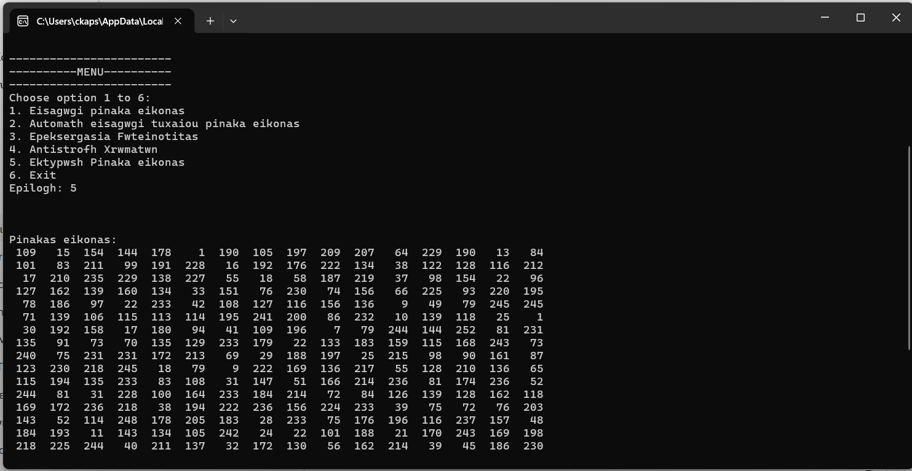
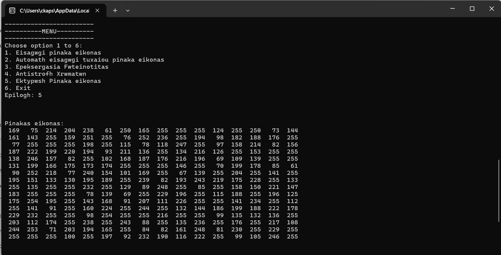
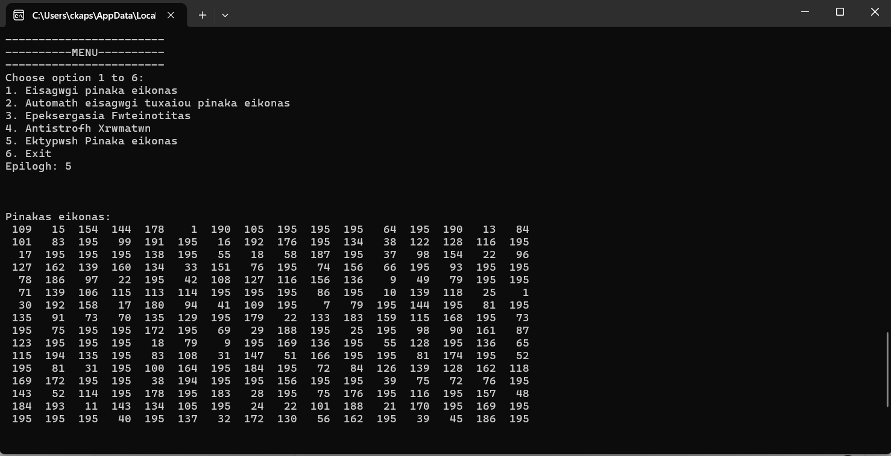
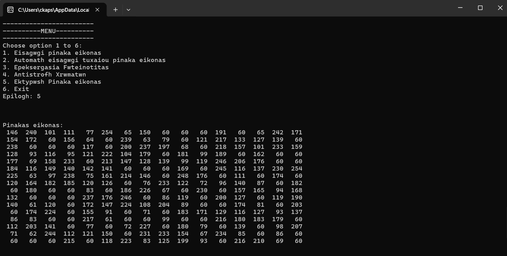

# Image Processing in C++

This repository contains a simple grayscale image processing implementation developed in C++ using object-oriented programming principles.

The project includes:
- grayscale image representation
- brightness manipulation
- color inversion
- pixel-based image processing
- dynamic 2D image storage using vectors

The implementation emphasizes matrix-based image processing concepts and computational manipulation of grayscale pixel intensity values.

## Repository Structure

- `src/`: C++ source code for the image processing implementation
- `examples/`: example outputs showing grayscale matrix transformations

## Concepts Demonstrated

- Object-Oriented Programming in C++
- Matrix-based grayscale image representation
- Pixel-level brightness adjustment
- Color inversion
- Dynamic 2D storage using vectors

## Example Outputs

### Original Grayscale Matrix

### Brightness Increase (+60)

### Brightness Decrease (-60)

### Color Inversion

## Tools

- C++
